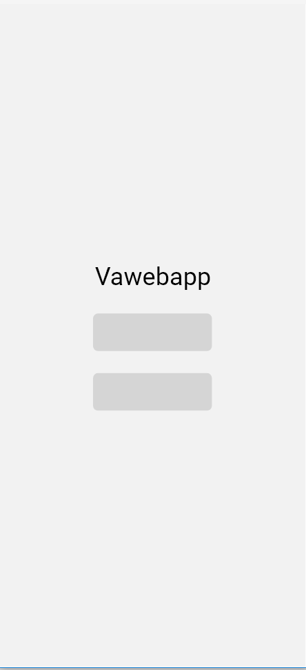
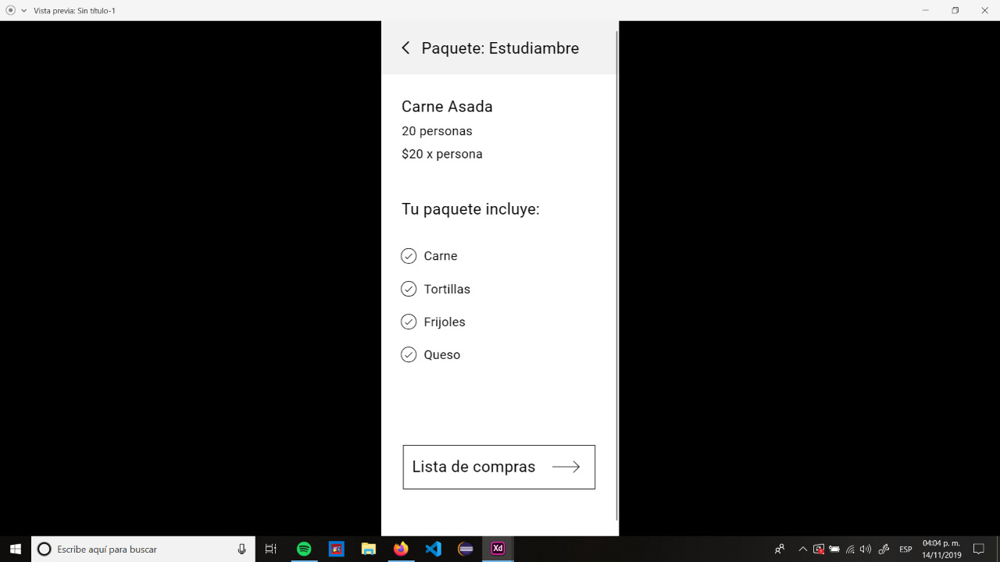
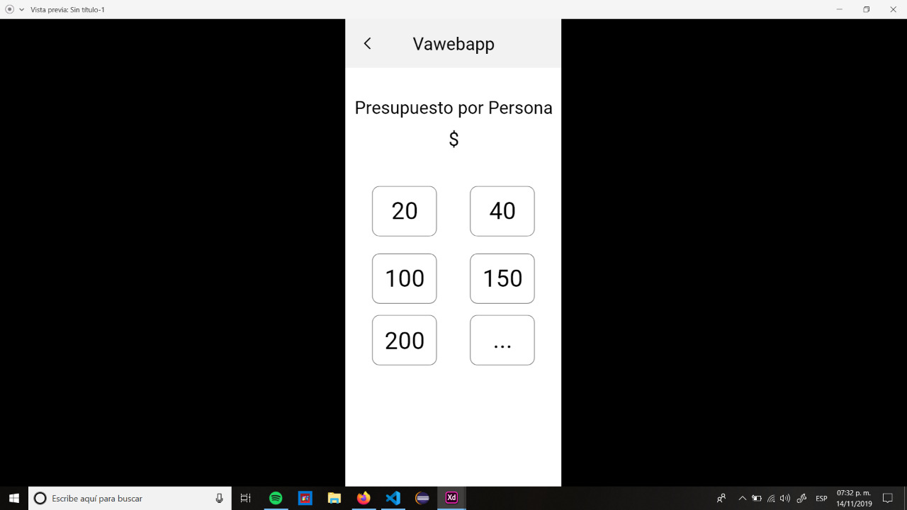
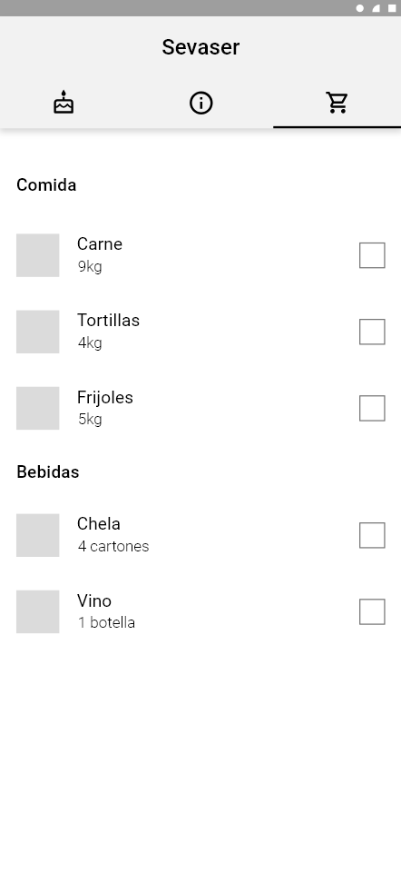

# Sevaser

Sevaser o no se vaser

#### Inspiracion

Una vez mis amigos no se ponian de acuerdo para hacer una hamburguesada. 

#### Introduccion

Vaquetapp te dice lo necesario para hacer una carne asada o hamburguesas con tus compas, desde una shop list hasta el precio total dividido por 
personas.

#### Instalacion

1. Descarga el repositorio

        git clone https://github.com/UrielMendozaG/Sevaser.git
        
2. Ejecuta el comando npm install dentro de la raiz del proyecto (my-app)

        cd my-app
        npm install
        
3. Levanta el servidor

         npm start
         
4. Explora 
         
         disfruta :)

#### Capturas

1. HOME 
2. PEOPLE 
3. PRESUPUESTO 
4. OVERVIEW 
5. SHOPPING 
